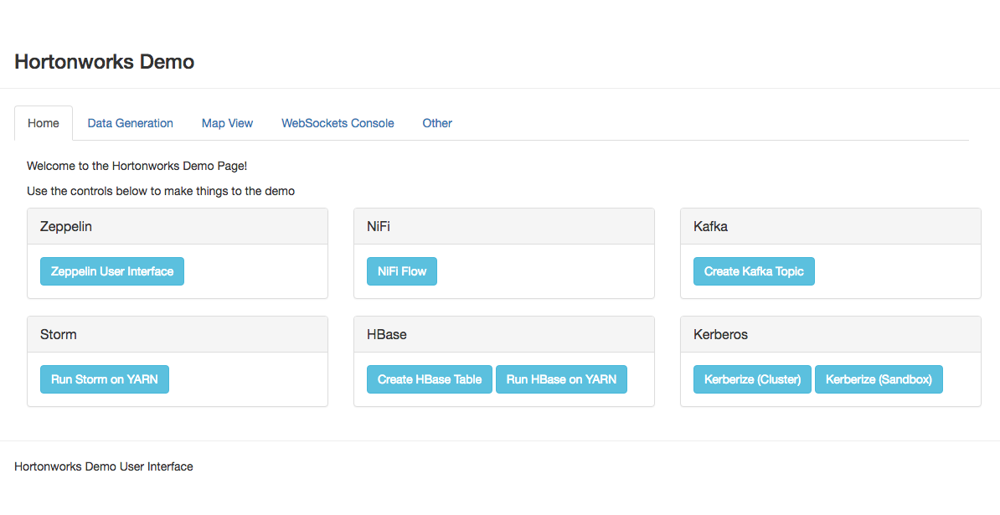
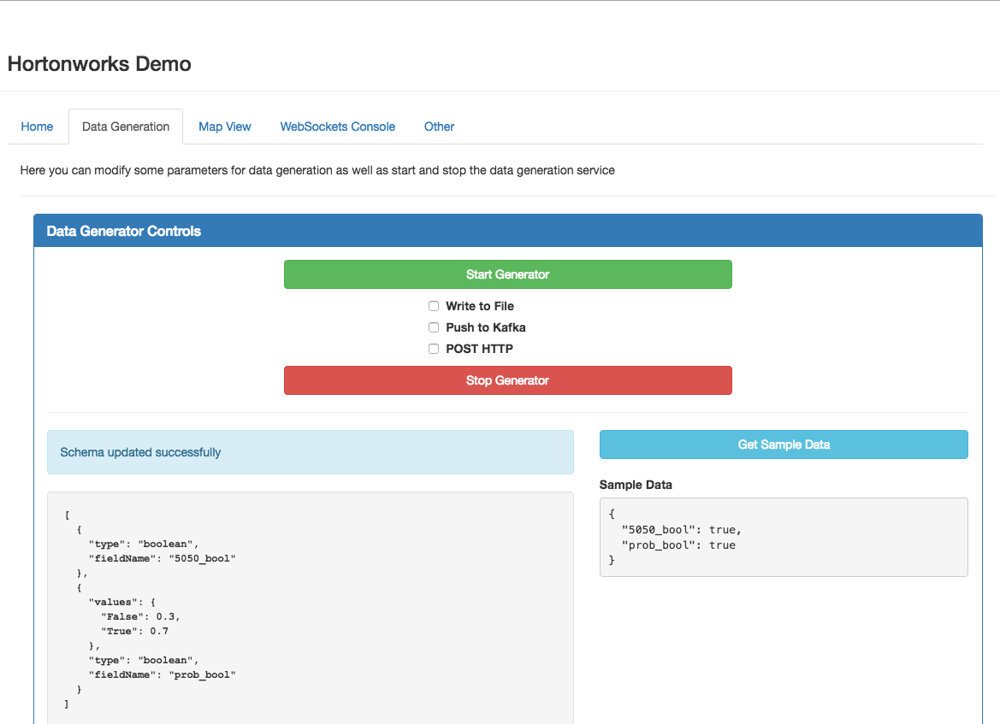

**********
User Guide
**********

Overview
========

Most of this project is written with python and is compatible with python version 2.6 and 2.7.

- The HTTP server utilizes `flask <http://flask.pocoo.org/>`_
- The websockets server uses `ws4py <https://ws4py.readthedocs.io/en/latest/>`_

It may run on python 3+ but has not been tested.

8998 is the default port that the web server will run on when installed
The websockets port is coded to always be the webserver port + 1

This means the default websockets port is 7888. The port can be changed in the Ambari interface.

After installing the demo service you should be able to run the server via Ambari. Once the service is running in Ambari connect to http://sandbox.hortonworks.com:8998

    
    
You should see a page like the above image.

There are 4 tabs you should explore.

- Home
- Data Generation
- Map View
- Websockets Console

Homepage
========

The homepage contains useful controls and links to other services. 

Zeppelin
--------

Here you'll find a link to the Zeppelin UI.

NiFi
----

Here you'll find a link to the NiFi UI

Kafka
-----

Using the button here you will create a Kafka topic with the name specified in the Ambari configuration.

Storm
-----

HBase
-----

Kerberos
--------

These are not currently functional

Data Generation
===============

You can use the data generation view to create configurations for random data and also choose to push that data to one of three locations.

Notice the three checkboxes. Using them you can decide where to send the data.

The cluster and topic for Kafka, HTTP url, and File location are all controlled by the Ambari configuration. To change the location you'll need to change them in Ambari and restart the service.

You can control the rate of data sent by modifying the Ambari configuration parameter ``demo.data.bytes_per_second``. 

Creating Data Configurations
----------------------------

First off I would suggest looking at the module documentation `demo_utils.generator module <../autodoc/demo_utils/demo_utils.generator.html>`_

  
For more detailed information on creating data configurations refer to the customization guide

`Creating custom data configs <customization/customization.html#data-generator>`_

You can create these "schemas" which define a table-like structure with field names that represent different datatypes.

I suggest using the UI to test new configurations and reading the module docs for more information.

Below are just a few examples

Simple Store:

.. code-block:: json
  :linenos:
  
  [
    {
      "type": "int",
      "fieldName": "price",
      "distribution": "gaussian",
      "mu": 50,
      "sigma": 20
    },
    {
      "type": "int",
      "fieldName": "store_number",
      "distribution": "gaussian",
      "mu": 10000,
      "sigma": 50
    },
    {
      "type": "boolean",
      "fieldName": "on_sale",
      "values": {
          "True": 0.23,
          "False": 0.77
      }
    },
    {
      "type": "string",
      "fieldName": "service_rep",
      "values": ["Kate", "Billy", "John", "Michelle"]
    }
  ]
  
Person Generator:

.. code-block:: json
  
  [
    {
      "fieldName": "fname",
      "type": "string",
      "values": ["Zac", "John", "Sally", "Mary", "Jane"]
    },
    {
      "fieldName": "lname",
      "type": "string",
      "values": {
        "Doe": 0.5,
        "Smith": 0.1,
        "Jones": 0.2,
        "Williams": 0.2
      }
    },
    {
      "fieldName": "age",
      "type": "int",
      "distribution": "uniform",
      "a": 18,
      "b": 75
    },
    {
      "fieldName": "gender",
      "type": "map",
      "mapFromField": "fname",
      "map": {
        "Zac": "M",
        "John": "M",
        "Sally": "F",
        "Mary": "F",
        "Jane": "F"
      }
    }
  ]
  

Map View
========

The map view is powered by `leaflet.js <http://leafletjs.com/>`_. 

Tiles are sourced from `OpenStreetMap <http://www.openstreetmap.org/>`_

While there are no use controls on the map view, most of the map can be controlled via javascript and leaflet.js.

I suggest reading through the `customization guide on implementing new map behavior <customization/customization.html#the-map-view>`_.

WebSockets Console
==================

The websockets console doesn't provide a whole lot of functionality but it does allow us to log any websocket data into the UI. This is useful if we want to show something that isn't geolocation data

